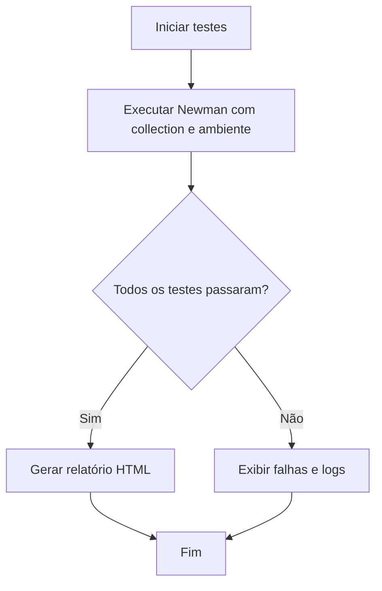

# Plano de Automação de Testes End-to-End com Newman/Postman

## Objetivo

Automatizar a execução de todos os endpoints da API, simulando o ciclo completo de negócio (autenticação, criação, consulta, atualização, deleção), utilizando a collection existente do Postman com o Newman.

---

## Etapas do Plano

1. **Revisar a collection do Postman**
   - Garantir que todos os endpoints e fluxos de negócio estejam cobertos.
   - Validar se variáveis de ambiente e scripts de pré-requisito estão corretos.

2. **Configurar ambiente de testes**
   - Usar [`postman/postman-environment.json`](postman/postman-environment.json:1) para variáveis (URLs, tokens, etc).
   - Ajustar variáveis sensíveis (usuários de teste, senhas, etc).

3. **Automatizar execução com Newman**
   - Adicionar script npm para rodar o Newman:
     ```json
     "scripts": {
       "test:api": "newman run postman/postman-collection.json -e postman/postman-environment.json --reporters cli,html --reporter-html-export newman-report.html"
     }
     ```
   - Permitir execução local e em CI/CD.

4. **Gerar relatórios**
   - Salvar relatório HTML da execução para análise posterior.

5. **(Opcional) Integração com pipeline**
   - Incluir o comando no pipeline de CI/CD para garantir testes automáticos a cada push.

---

## Fluxo Resumido



---

## Observações

- Se necessário, ajustar a collection para cobrir cenários ponta a ponta (ex: criar entidade, consultar, atualizar, deletar).
- Garantir que o ambiente de testes seja isolado para evitar impacto em dados reais.
- O relatório `newman-report.html` pode ser versionado no `.gitignore`.