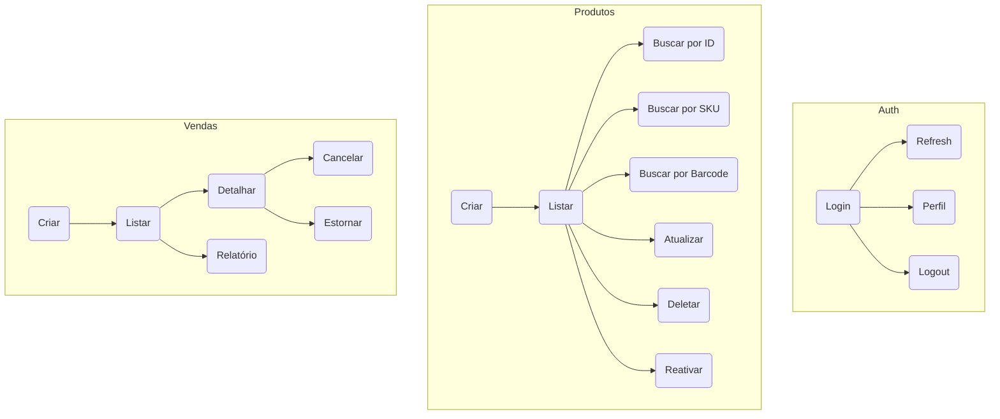

# Plano para Collection Completa de Testes Automatizados (Postman/Newman)

## Objetivo

Cobrir **todos os endpoints** do backend, simulando cenários reais de uso, fluxos de autenticação, permissões, CRUD, filtros, relatórios, auditoria, health check e casos de erro.

---

## Estrutura Recomendada

### 1. Autenticação (Auth)
- Login (salvar token e refreshToken)
- Refresh token (usar valor salvo)
- Registro de usuário e tenant
- Perfil, troca de senha, logout, sessões
- Criação de usuários por admin/manager

### 2. Produtos
- CRUD completo (criar, listar, buscar por ID, SKU, barcode, atualizar, deletar, reativar)
- Listar unidades, produtos com baixo estoque
- Testar permissões de acesso

### 3. Categorias
- CRUD completo
- Testar restrições de manager/admin

### 4. Clientes
- CRUD completo
- Histórico de vendas do cliente

### 5. Vendas
- Criar venda, listar, detalhar, relatórios
- Cancelar e estornar venda (manager/admin)
- Testar regras de negócio (ex: estoque, permissões)

### 6. Estoque
- Consultar, movimentar, ajustar, monitorar
- Alertas de estoque (listar, marcar como lido, resolver)
- Relatórios de estoque

### 7. Auditoria
- Listar logs, estatísticas, exportar, limpar logs

### 8. Health Check
- Testar endpoints de status da API

---

## Tipos de Testes

- **Fluxo feliz:** operações válidas, dados corretos, permissões adequadas.
- **Fluxo de erro:** dados inválidos, permissões insuficientes, recursos inexistentes.
- **Assertions:** status HTTP, estrutura do JSON, mensagens de erro, campos obrigatórios.
- **Testes de autenticação:** token expirado, refresh, logout, acesso negado.
- **Testes de permissão:** usuário comum, manager, admin, multi-tenant.

---

## Exemplo de Organização (Mermaid)

---

## Recomendações

- Use scripts de teste para salvar tokens, IDs e validar respostas.
- Utilize variáveis de ambiente para URLs, tokens, IDs dinâmicos.
- Implemente assertions em todos os requests.
- Simule diferentes perfis de usuário e cenários multi-tenant.
- Inclua casos de erro e respostas esperadas.
- Atualize a collection conforme novas rotas e regras de negócio forem criadas.

---

## Próximos Passos

1. Gerar esqueleto inicial da collection com todos os endpoints.
2. Preencher exemplos de payloads e variáveis.
3. Adicionar scripts de teste e assertions.
4. Validar execução automatizada com Newman.